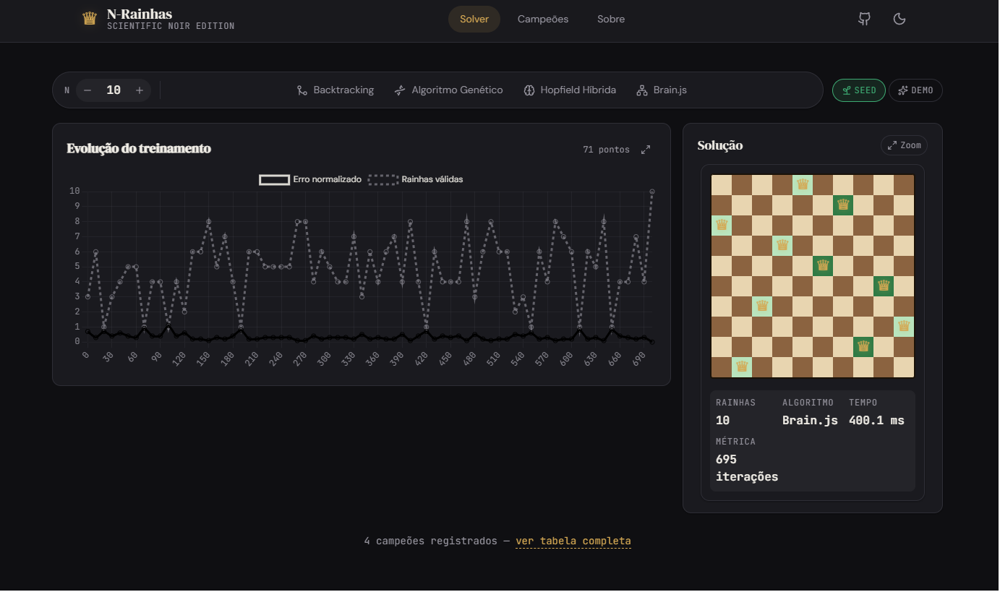
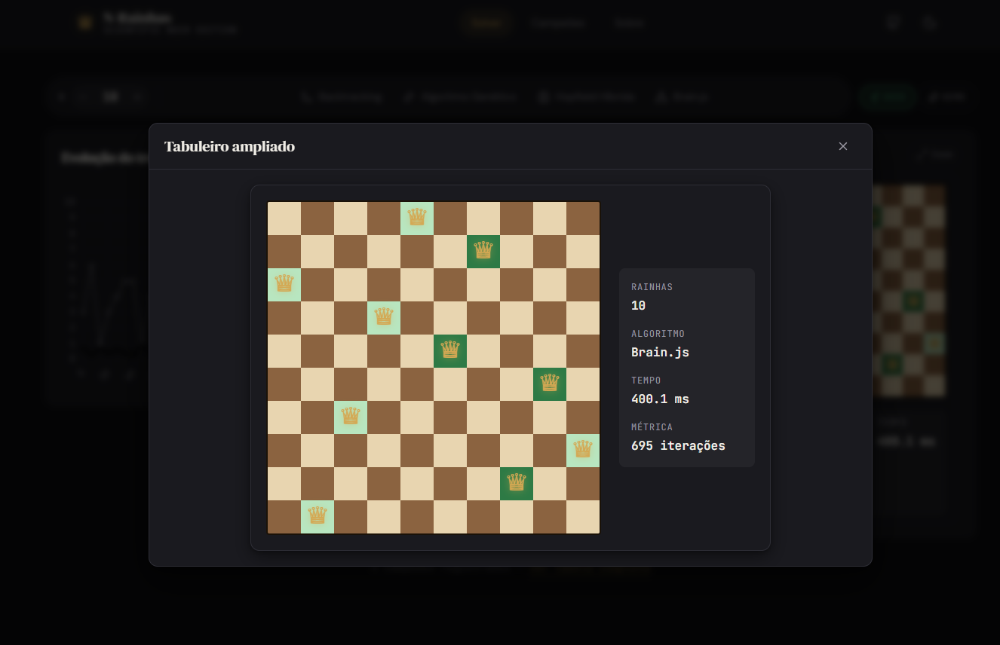
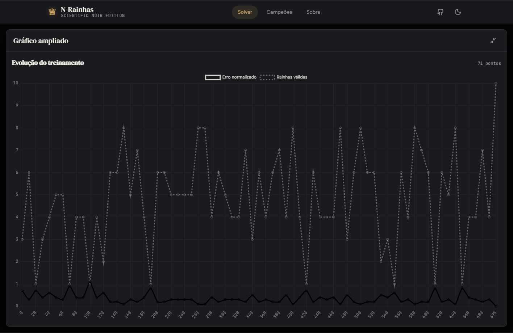
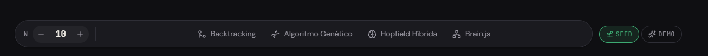
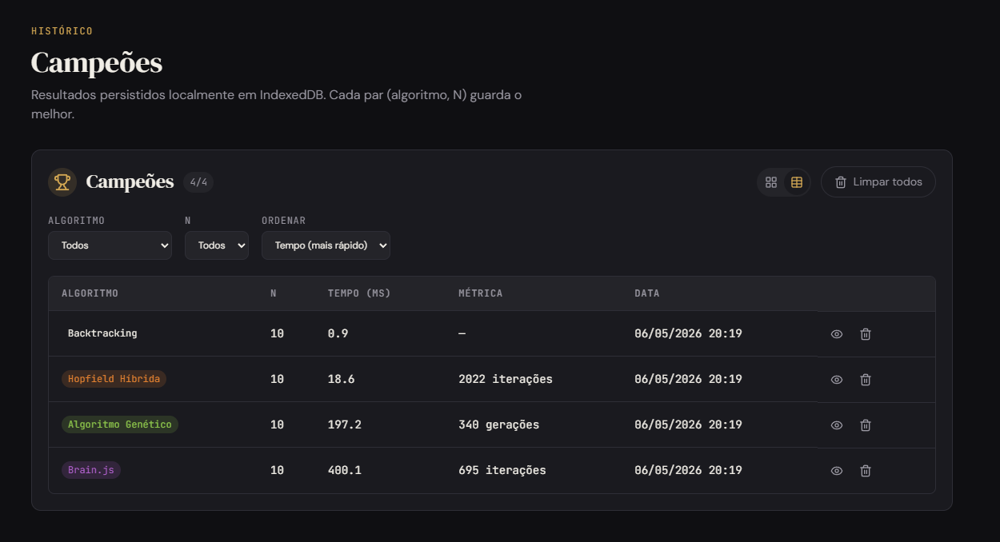
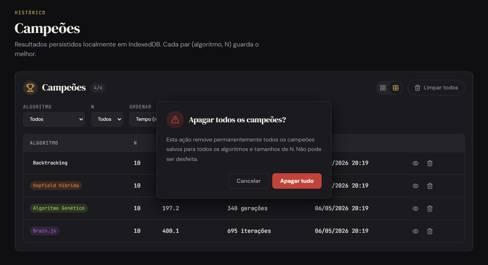
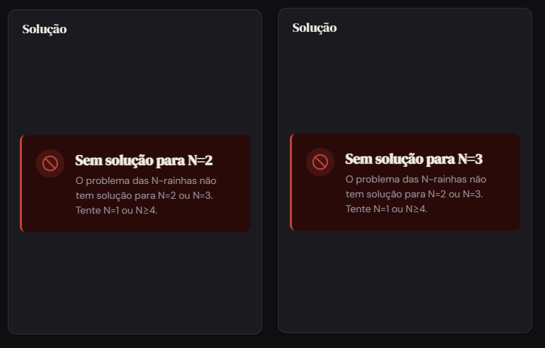
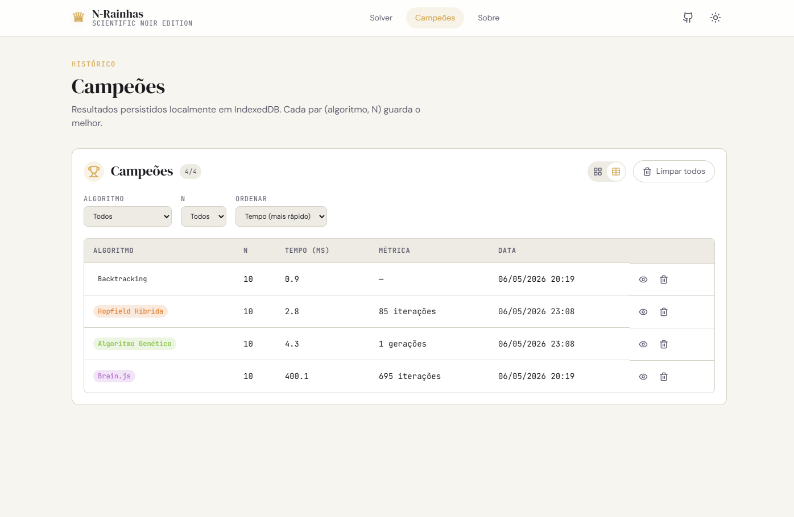
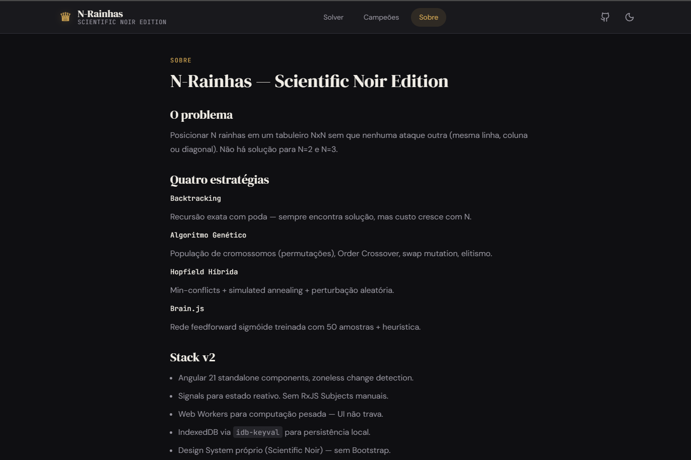

# ♛ N-Rainhas SPA

Bancada de comparação interativa entre 4 algoritmos para o problema das N-Rainhas (Backtracking, Algoritmo Genético, Rede de Hopfield Híbrida e Brain.js). Cada execução roda em um Web Worker dedicado — a UI nunca trava.

🌐 **Demo:** [silvino-miranda.github.io/n-rainhas-spa](https://silvino-miranda.github.io/n-rainhas-spa/)

> ⚠️ **Primeira vez clonando?** Antes do deploy automático funcionar, é preciso ativar GitHub Pages uma única vez: `Settings → Pages → Source: GitHub Actions`. Runbook completo em [`docs/deploy/GITHUB-PAGES.md`](docs/deploy/GITHUB-PAGES.md).

---

## 📸 Screenshots

### Solver — chart-first (chart à esquerda, mini-tabuleiro à direita)



### Tabuleiro ampliado — modal com legenda à direita



### Gráfico ampliado — tela cheia abaixo da topbar



### Toolbar compacta — stepper N + pills coloridas dos 4 algoritmos



### Campeões — tabela com filtros (algoritmo, N) + ordenação



### ConfirmDialog — confirmação destrutiva (tom danger)



### NoSolutionAlert — N=2 ou N=3



### Tema claro — alternado pelo ThemeToggle (persiste em localStorage)



### Página Sobre — /about



---

## ⚡ Stack v2 (Scientific Noir)

| Camada | Tecnologia |
|---|---|
| Framework | Angular 21 (standalone, **zoneless**, signals) |
| Linguagem | TypeScript 5.9 (strict) |
| UI | Design System próprio (`--nq-*` tokens) — sem Bootstrap |
| Tipografia | DM Serif Display + DM Sans + JetBrains Mono |
| Ícones | lucide-angular |
| Charts | Chart.js 4 (lazy via `@defer`) |
| IA | brain.js — bundlado no worker |
| Persistência | IndexedDB via `idb-keyval` (migração v1→v2 idempotente) |
| Workers | 4 dedicados (backtracking, ga, nn, brain) |
| Test | Vitest + jsdom + `@analogjs/vitest-angular` |
| Lint | ESLint 9 flat config + angular-eslint 21 |
| Pkg manager | pnpm 9.15 |
| CI/CD | GitHub Actions → GitHub Pages |

## 🎯 Funcionalidades

- **4 estratégias** com tooltip explicativa em cada AlgorithmCard
- **Modo Demo** — roda os 4 algoritmos em sequência
- **Cancelamento de execução** durante o run
- **Mini-board com tamanho constante** (input `targetSize`)
- **Zoom modal** do tabuleiro com legenda à direita (`statsPosition: 'beside'`)
- **Chart full-screen** preservando topbar (top: 64px)
- **Tabela de campeões** com filtros (algoritmo, N) + ordenação (tempo / N / algoritmo / data)
- **Persistência local** em IndexedDB com migração de schema v1
- **Tema claro/escuro** com `prefers-color-scheme` + override manual + sync sem flash
- **Acessibilidade** — focus-visible global, ARIA, `prefers-reduced-motion`, `prefers-contrast`

## 🚀 Como executar

```bash
# Instalar dependências (corepack provisiona pnpm@9.15.0)
pnpm install

# Servidor de desenvolvimento (http://localhost:4200)
pnpm start

# Build de produção em dist/n-rainhas/browser
pnpm build

# Testes
pnpm test            # vitest run
pnpm test:watch      # vitest dev
pnpm test:coverage   # com cobertura v8

# Lint + typecheck
pnpm lint
pnpm typecheck
```

## 📁 Estrutura do projeto

```
src/app/
├── core/
│   └── theme/                      # ThemeService (signal + APP_INITIALIZER)
├── data-access/
│   └── persistence.service.ts      # IndexedDB via idb-keyval
├── design-system/
│   └── tokens/                     # _tokens.scss + _reset.scss
├── shared/
│   ├── models/                     # ChampionV2, AlgorithmType, etc.
│   ├── ui/                         # AppShell, ThemeToggle, EmptyState, ConfirmDialog
│   └── utils/                      # worker-client.ts (RxJS wrapper)
└── features/
    ├── about/                      # Página /about
    ├── champions/                  # Página /champions
    └── queens-solver/              # Página principal
        ├── components/             # FormControls, AlgorithmCard, ResultsBoard,
        │                           # TrainingChart, BoardZoomDialog,
        │                           # ChartExpandDialog, ChampionsTable, ...
        ├── services/               # SolverOrchestrator
        ├── state/                  # QueensSolverStore (signal store)
        └── workers/                # 4 web workers + _solvers/ puros
```

## 📚 Documentação

- [PRD AS-IS](docs/prd/PRD-AS-IS.md) — fotografia do estado pré-v2
- [PRD TO-BE v2](docs/prd/PRD-TO-BE-v2.md) — design system, arquitetura, roadmap
- [DELTA v2](docs/prd/DELTA-v2.md) — entregue × pendente
- [Deploy Pages](docs/deploy/GITHUB-PAGES.md) — runbook completo + troubleshooting
- [Self-host (K3s)](docs/deploy/SELF-HOSTED.md) — Dockerfile, nginx, manifests

## 📝 Licença

MIT
